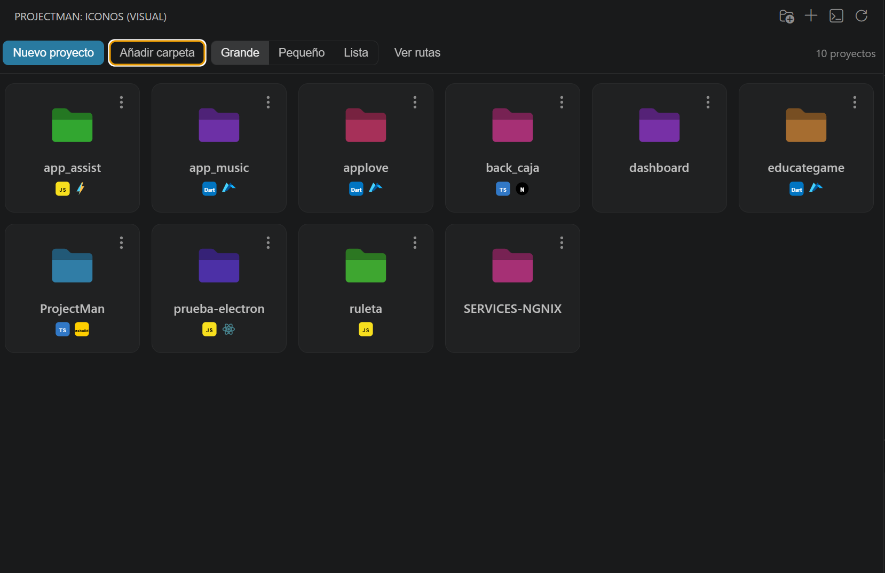
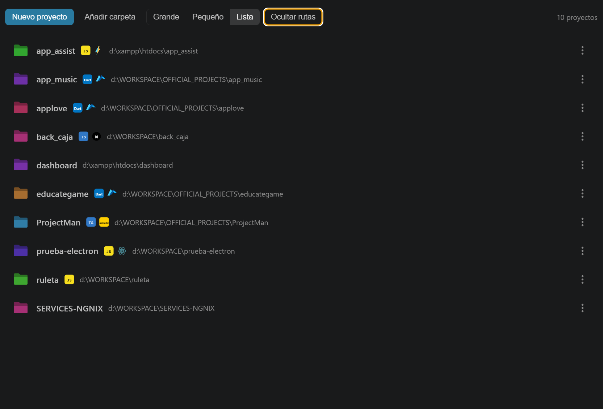
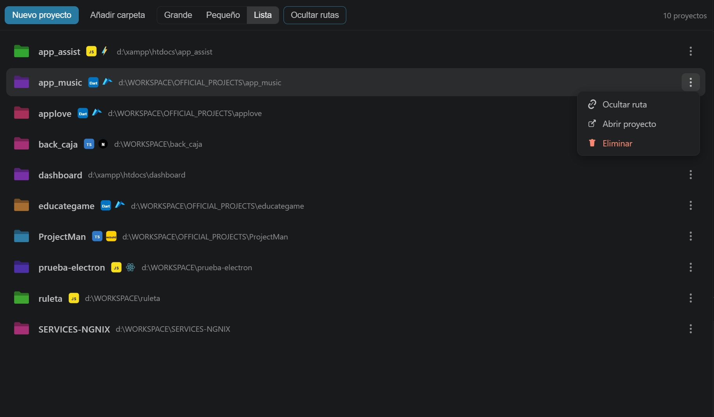

# 🚀 ProjectMan

> **Manage all your projects directly from Visual Studio Code.**

Project Man is a VS Code extension that helps you **organize, manage, and quickly open your development projects**, even when they are stored in different folders or drives.

> **One place. All your projects.**

<p align="center">
  
</p>

<p align="center">

[](https://code.visualstudio.com/)
[](https://marketplace.visualstudio.com/items?itemName=bernardohuaira.projectman)
[](https://marketplace.visualstudio.com/items?itemName=bernardohuaira.projectman)
[](https://marketplace.visualstudio.com/items?itemName=bernardohuaira.projectman)
[](LICENSE)

</p>

<p align="center">
  <a href="https://marketplace.visualstudio.com/items?itemName=bernardohuaira.projectman">
    <strong>🚀 Install ProjectMan</strong>
  </a>
</p>

---

## ✨ Why ProjectMan?

As developers, we often work on multiple projects stored in different locations:

```text
Documents/
Downloads/
Desktop/
Projects/
Work/
D:\Development/
D:\Clients/
```

Finding and opening those projects repeatedly can become frustrating.

**ProjectMan keeps them accessible from one place inside VS Code.**

Instead of:

```text
Search for folder
       ↓
Find project
       ↓
Open folder
       ↓
Start working
```

You can simply:

```text
Open ProjectMan
       ↓
Select your project
       ↓
Open
       ↓
Start working 🚀
```

---

## ✨ Features

### 📂 Centralized Project Management

Keep projects from different folders and drives in one centralized ProjectMan interface.

### ➕ Add Existing Projects

Add an existing project by selecting its folder.

ProjectMan remembers the project so you can access it later without searching for its location again.

### 🚀 Open Projects with One Click

Open a registered project directly from ProjectMan.

### 🆕 Create New Projects

Create a new empty project and choose where it should be stored.

### 🗑️ Remove Projects

Remove projects from your ProjectMan list when they are no longer needed.

> Removing a project from ProjectMan does not necessarily delete the project files from your computer. Always review the confirmation shown by the extension.

### 🎨 Visual Project Interface

Access your projects through a dedicated ProjectMan interface inside the VS Code Activity Bar.

### ⌨️ Command Support

Use the VS Code Command Palette to access ProjectMan actions quickly.

---

## 📸 Screenshots

### ProjectMan Dashboard

<p align="center">
  
</p>

### Add a Project

<p align="center">
  
</p>

### Project Actions

<p align="center">
  
</p>

---

## 🧩 Supported Projects

ProjectMan can be used with virtually any project that can be opened as a folder in VS Code.

Examples include:

* 🌐 Web applications
* ⚙️ Backend APIs
* ⚛️ React applications
* 🟢 Node.js projects
* 🟣 Laravel projects
* 🔷 .NET projects
* 🟢 Angular applications
* 🟢 Vue applications
* 🌐 WordPress projects
* 📱 Mobile projects
* 🎓 University projects
* 💼 Client projects
* 🚀 Personal projects

Your projects do **not** need to be stored in the same parent directory.

---

## ⌨️ Commands

ProjectMan provides the following commands through the VS Code Command Palette:

| Command                                  | Description                      |
| ---------------------------------------- | -------------------------------- |
| `ProjectMan: Mostrar proyectos`          | Open the ProjectMan project list |
| `ProjectMan: Añadir proyecto`            | Add an existing project          |
| `ProjectMan: Crear nuevo proyecto`       | Create a new project             |
| `ProjectMan: Crear proyecto con comando` | Create a project using a command |
| `ProjectMan: Abrir proyecto`             | Open a project                   |
| `ProjectMan: Eliminar proyecto`          | Remove a project                 |
| `ProjectMan: Actualizar`                 | Refresh the project list         |

---

## 📦 Installation

### Visual Studio Code Marketplace

The easiest way to install ProjectMan:

1. Open **Visual Studio Code**.
2. Open the Extensions view with `Ctrl + Shift + X`.
3. Search for **ProjectMan**.
4. Select **ProjectMan**.
5. Click **Install**.

You can also install it directly from the:

**[Visual Studio Code Marketplace](https://marketplace.visualstudio.com/items?itemName=bernardohuaira.projectman)**

---

## 🚀 Getting Started

After installing ProjectMan:

1. Open Visual Studio Code.
2. Find the **ProjectMan** icon in the Activity Bar.
3. Add your existing projects.
4. Create new projects when needed.
5. Select a project to open it instantly.

ProjectMan will keep your registered projects available for quick access.

---

## 🗺️ Roadmap

ProjectMan is actively being improved.

Planned features include:

* 🔍 Project search
* ⭐ Favorites
* 📁 Project categories and groups
* 🏷️ Custom tags
* ↕️ Sorting and filtering
* 🕘 Recent projects
* 🎨 Custom project icons
* 📊 Project metadata
* 📥 Import and export projects
* ☁️ Cloud synchronization
* 💾 Backup and restore
* 📦 Project templates
* ⌨️ Improved keyboard navigation
* ⚡ Additional commands and shortcuts

Have a feature idea? **[Open an issue](https://github.com/BrLearnix/ProjectMan/issues)** and let us know.

---

## 🐞 Troubleshooting

### A project does not open

Check that:

1. The project folder still exists.
2. The folder has not been moved or renamed.
3. The stored path is correct.
4. VS Code has permission to access the folder.

### ProjectMan does not appear

Try:

1. Reloading Visual Studio Code.
2. Checking that ProjectMan is installed and enabled.
3. Restarting VS Code.
4. Checking the Extension Host logs if the problem persists.

If the problem continues, please **[open an issue](https://github.com/BrLearnix/ProjectMan/issues)**.

---

## 🤝 Contributing

Contributions, ideas, bug reports, and feature requests are welcome.

### Development

Clone the repository:

```bash
git clone https://github.com/BrLearnix/ProjectMan.git
```

Open the project:

```bash
cd ProjectMan
code .
```

Install dependencies:

```bash
npm install
```

Run the extension using the **VS Code Extension Development Host**.

---

## 💡 Feedback

Have an idea for ProjectMan?

You can:

* 🐞 Report a bug
* 💡 Request a feature
* 💬 Share feedback
* 🔧 Contribute code
* ⭐ Rate the extension
* 📢 Share ProjectMan with other developers

**Your feedback helps ProjectMan grow.**

---

## 👨‍💻 Author

**Bernardo Huaira**

Developer and creator of ProjectMan.

* 💻 [GitHub](https://github.com/BrLearnix)
* 📸 [Instagram](https://www.instagram.com/bernardohuaira1/)

---

## 📄 License

ProjectMan is licensed under the **MIT License**.

See the [LICENSE](LICENSE) file for details.

---

## ⭐ Support ProjectMan

If ProjectMan is useful to you:

⭐ **Rate the extension on the VS Code Marketplace.**

💬 **Leave a review.**

🐞 **Report bugs.**

💡 **Suggest features.**

📢 **Share ProjectMan with other developers.**

Every installation, review, and contribution helps the project grow.

---

<p align="center">

### 🚀 ProjectMan

**Manage your projects. Open them faster. Stay organized.**

**Directly inside Visual Studio Code.**

</p>
